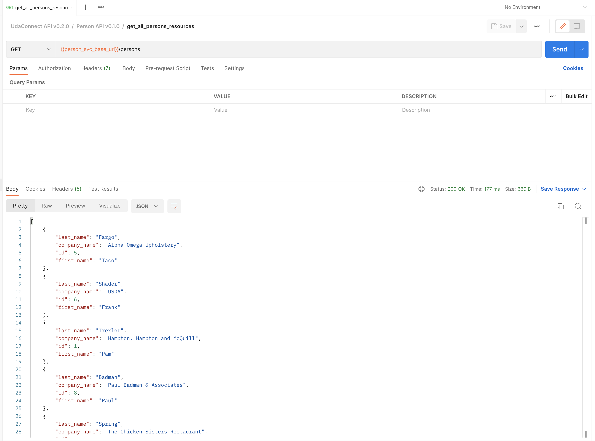
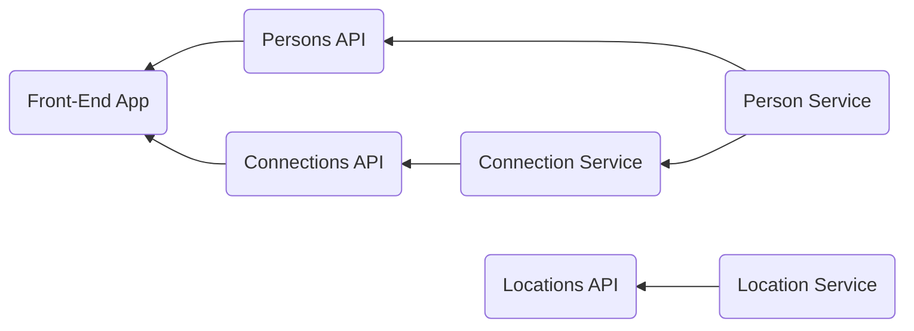
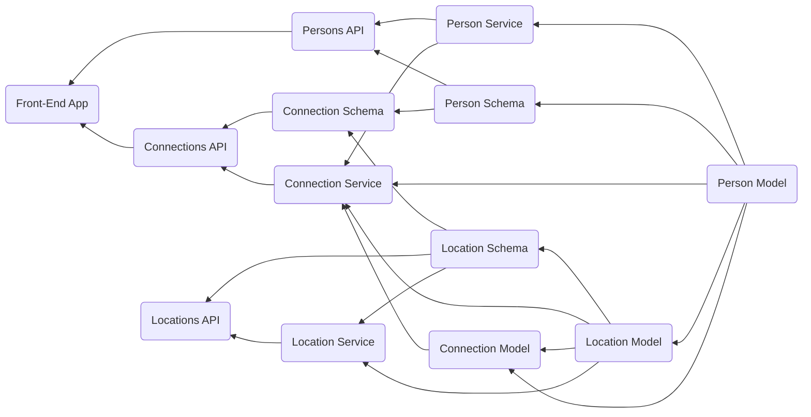

<!-- markdownlint-configure-file {
  "MD033": false,
  "MD041": false
} -->

#  UdaConnect

<div align="center">

[Overview](#overview) •
[Technologies](#technologies) •
[Getting Started](#getting-started) •
[Architecture Diagrams](#architecture-diagrams) •
[Author](#book-author)

[![UdaConnect Client App][udaconnect-client-status-badge]][udaconnect-client-wflow]
[![UdaConnect Person Service][udaconnect-person-svc-status-badge]][udaconnect-person-svc-wflow]
[![UdaConnect Connection Service][udaconnect-conn-svc-status-badge]][udaconnect-conn-svc-wflow]
[![UdaConnect Location Service][udaconnect-location-svc-status-badge]][udaconnect-location-svc-wflow]

</div>

<div align="center">


</div>

## Overview

### Background

&nbsp;&nbsp;&nbsp;&nbsp;Conferences and conventions are hotspots for making connections. Professionals in attendance often share the same interests and can make valuable business and personal connections with one another. At the same time, these events draw a large crowd and it's often hard to make these connections in the midst of all of these events' excitement and energy. To help attendees make connections, we are building the infrastructure for a service that can inform attendees if they have attended the same booths and presentations at an event.

### Goal

&nbsp;&nbsp;&nbsp;&nbsp;You work for a company that is building a app that uses location data from mobile devices. Your company has built a [POC][poc] application to ingest location data named UdaTracker. This POC was built with the core functionality of ingesting location and identifying individuals who have shared a close geographic proximity.

&nbsp;&nbsp;&nbsp;&nbsp;Management loved the POC so now that there is buy-in, we want to enhance this application. You have been tasked to enhance the POC application into a [MVP][mvp] to handle the large volume of location data that will be ingested.

&nbsp;&nbsp;&nbsp;&nbsp;To do so, **_you will refactor this application into a microservice architecture using message passing techniques that you have learned in this course_**. It’s easy to get lost in the countless optimizations and changes that can be made: your priority should be to approach the task as an architect and refactor the application into microservices. File organization, code linting -- these are important but don’t affect the core functionality and can possibly be tagged as TODO’s for now!

## Technologies

- [Flask][flask] - API webserver
- [SQLAlchemy][sqlalchemy] - Database ORM
- [PostgreSQL][postgresql] - Relational database
- [PostGIS][postgis] - Spatial plug-in for PostgreSQL enabling geographic queries]
- [Vagrant][vagrant] - Tool for managing virtual deployed environments
- [VirtualBox][vbox] - Hypervisor allowing you to run multiple operating systems
- [K3s][k3s] - Lightweight distribution of K8s to easily develop against a local cluster

## Getting Started

The project has been set up such that you should be able to have the project up and running with Kubernetes.

### Prerequisites

We will be installing the tools that we'll need to use for getting our environment set up properly.

1. [Install Docker][docker-install]
2. [Set up a DockerHub account][docker-hub]
3. [Set up `kubectl`][k3s-kubectl-setup]
4. [Install VirtualBox][vbox-install] with at least version 6.0
5. [Install Vagrant][vagrant-install] with at least version 2.0
6. [Install OpenSSH][openssh-install]
7. [Install sshpass][sshpass-install]

### Environment Setup

To run the application, you will need a K8s cluster running locally and to interface with it via `kubectl`. We will be using Vagrant with VirtualBox to run K3s.

#### Initialize K3s

In this project's root, run `vagrant up`.

```bash
vagrant up
```

The command will take a while and will leverage VirtualBox to load an [openSUSE](https://www.opensuse.org/) OS and automatically install [K3s](https://k3s.io/). When we are taking a break from development, we can run `vagrant suspend` to conserve some ouf our system's resources and `vagrant resume` when we want to bring our resources back up. Some useful vagrant commands can be found in [this cheatsheet](https://gist.github.com/wpscholar/a49594e2e2b918f4d0c4).

#### Set up `kubectl`

#### Easy Way

&nbsp;&nbsp;&nbsp;&nbsp;After running `vagrant up`, you can use `scripts/copy_kubeconfig.sh` script to install `/etc/rancher/k3s/k3s.yaml` file onto your local machine.

> **Warning**: You need to run the script from the project's root directory where `Vagrantfile` resides otherwise, it will fail.

Execute the following:

```bash
$ bash scripts/copy_kubeconfig.sh
connecting to vagrant@127.0.0.1:2000..
connection success..
copying k3s kubeconfig to /Users/shehabeldeen/.kube/config
```

> 📝 **Note:**
>
> - `copy_kubbeconfig.sh` accepts one argument; `config_path` which is the destination path of the `k3s.yaml` to be installed in. By default it is equal to `"${HOME}/.kube/config"`
> - `copy_kubbeconfig.sh` needs 4 environment variables:
>   - `SSH_USER`: remote user accessed by vagrant ssh, by default is, `vagrant`.
>   - `SSH_USER_PASS`: remote user password, by default is `vagrant`.
>   - `SSH_PORT`: ssh port, by default is `2000` which is forwarded from host machine to guest machine at `22`.
>   - `SSH_HOST`: ssh server hostname, by default is `localhost`

#### Hard Way

&nbsp;&nbsp;&nbsp;&nbsp;After `vagrant up` is done, you will SSH into the Vagrant environment and retrieve the Kubernetes config file used by `kubectl`. We want to copy the contents of this file into our local environment so that `kubectl` knows how to communicate with the K3s cluster.

```bash
vagrant ssh
```

You will now be connected inside of the virtual OS. Run `sudo cat /etc/rancher/k3s/k3s.yaml` to print out the contents of the file. You should see output similar to the one that I've shown below. Note that the output below is just for your reference: every configuration is unique and you should _NOT_ copy the output I have below.

Copy the contents from the output issued from your own command into your clipboard -- we will be pasting it somewhere soon!

```bash
$ sudo cat /etc/rancher/k3s/k3s.yaml

apiVersion: v1
clusters:
- cluster:
    certificate-authority-data: LS0tLS1CRUdJTiBDRVJUSUZJQ0FURS0tLS0tCk1JSUJWekNCL3FBREFnRUNBZ0VBTUFvR0NDcUdTTTQ5QkFNQ01DTXhJVEFmQmdOVkJBTU1HR3N6Y3kxelpYSjIKWlhJdFkyRkFNVFU1T1RrNE9EYzFNekFlRncweU1EQTVNVE13T1RFNU1UTmFGdzB6TURBNU1URXdPVEU1TVROYQpNQ014SVRBZkJnTlZCQU1NR0dzemN5MXpaWEoyWlhJdFkyRkFNVFU1T1RrNE9EYzFNekJaTUJNR0J5cUdTTTQ5CkFnRUdDQ3FHU000OUF3RUhBMElBQk9rc2IvV1FEVVVXczJacUlJWlF4alN2MHFseE9rZXdvRWdBMGtSN2gzZHEKUzFhRjN3L3pnZ0FNNEZNOU1jbFBSMW1sNXZINUVsZUFOV0VTQWRZUnhJeWpJekFoTUE0R0ExVWREd0VCL3dRRQpBd0lDcERBUEJnTlZIUk1CQWY4RUJUQURBUUgvTUFvR0NDcUdTTTQ5QkFNQ0EwZ0FNRVVDSVFERjczbWZ4YXBwCmZNS2RnMTF1dCswd3BXcWQvMk5pWE9HL0RvZUo0SnpOYlFJZ1JPcnlvRXMrMnFKUkZ5WC8xQmIydnoyZXpwOHkKZ1dKMkxNYUxrMGJzNXcwPQotLS0tLUVORCBDRVJUSUZJQ0FURS0tLS0tCg==
    server: https://127.0.0.1:6443
  name: default
contexts:
- context:
    cluster: default
    user: default
  name: default
current-context: default
kind: Config
preferences: {}
users:
- name: default
  user:
    password: 485084ed2cc05d84494d5893160836c9
    username: admin
```

Type `exit` to exit the virtual OS and you will find yourself back in your computer's session. Create the file (or replace if it already exists) `~/.kube/config` and paste the contents of the `k3s.yaml` output here.

Afterwards, you can test that `kubectl` works by running a command like `kubectl describe services`. It should not return any errors.

### Steps

1. `kubectl apply -f deployment/` - Set up `UdaConnect` workloads:

   1. `UdaConnect Client App`.
   2. `UdaConnect Person Service`.
   3. `UdaConnect Location Service`.
   4. `UdaConnect Connection Service`.
   5. `PostgreSQL Database`.
   6. `Kafka Broker Server`.
   7. `Zookeeper Server`.

    </br>

    <div align="center">

   ![UdaConnect Kubernetes Workloads][udaconnect-k8s-live-creation]

    </div>

   > :memo: **Note:**
   >
   > - When you first run the command it's expected for some containers to restart. When you rerun the command after you have saved downloaded the images on the VM, this won't happen again. The manfiests have been configured with init containers to wait for dependencies.

    <div align="center">

   ![UdaConnect Kubernetes Workloads for the first time][udaconnect-k8s-live-1st-time]

    </div>

   > - `kafka-server` will not start until `zookeeper-server` is up and running properly. It will also auto-create `locations` topic on initialization.
   > - `udaconnect-locations-service` will wait for 60 secs to ensure that `kafka-server` is up and the `locations` topic has been created.

2. `sh scripts/run_db_command.sh <POD_NAME>` - Seed your database against the `postgres` pod. (`kubectl get pods` will give you the `POD_NAME`):

```bash
$ sh scripts/run_db_command.sh "${postgres_pod_name}"

CREATE TABLE
CREATE TABLE
CREATE INDEX
CREATE INDEX
INSERT 0 1
INSERT 0 1
INSERT 0 1
INSERT 0 1
INSERT 0 1
... output ommitted
```

:memo: **Note:** The first time you run this project, you will need to seed the database with dummy data. Use the command `sh scripts/run_db_command.sh <POD_NAME>` against the `postgres` pod. (`kubectl get pods` will give you the `POD_NAME`). Subsequent runs of `kubectl apply` for making changes to deployments or services shouldn't require you to seed the database again!

### Verifying it Works

Once the project is up and running, you should be able to see 7 deployments and 7 services in Kubernetes:

<div align="center">

![UdaConnect Kubernetes Workloads][udaconnect-k8s-live]

</div>

These pages should also load on your web browser:

- `http://localhost:30000/` - Frontend ReactJS Application
- `http://localhost:30002/` - Location Service Swagger Documentation
- `http://localhost:30002/api/` - Base path for Location API
- `http://localhost:30003/` - Person Service Swagger Documentation
- `http://localhost:30003/api/` - Base path for Person Service API
- `http://localhost:30004/` - Connection Service Swagger Documentation
- `http://localhost:30004/api/` - Base path for Connection Service API

#### Postman

You can also import [UdaConnect API v0.2.0 Postman collection][udaconnect-postman-collection] and test the deployment using `get_all_persons_resources`:

<div align="center">



</div>

#### UdaConnect Client App

Open browser at `http://localhost:30000`:

<div align="center">

![Browser - UdaConnect Client Application][udaconnect-client-app]

> **Note**: When clicking on a person to fetch his connections you may experience slow response due to limited resources of the VM. `gRPC` requires to have better resources.

</div>

#### Deployment Note

You may notice the odd port numbers being served to `localhost`. [By default, Kubernetes services are only exposed to one another in an internal network](https://kubernetes.io/docs/concepts/services-networking/service/). This means that `udaconnect-app` and `udaconnect-api` can talk to one another. For us to connect to the cluster as an "outsider", we need to a way to expose these services to `localhost`.

Connections to the Kubernetes services have been set up through a [NodePort](https://kubernetes.io/docs/concepts/services-networking/service/#nodeport). (While we would use a technology like an [Ingress Controller](https://kubernetes.io/docs/concepts/services-networking/ingress-controllers/) to expose our Kubernetes services in deployment, a NodePort will suffice for development.)

## PostgreSQL Database

The database uses a plug-in named PostGIS that supports geographic queries. It introduces `GEOMETRY` types and functions that we leverage to calculate distance between `ST_POINT`'s which represent latitude and longitude.

_You may find it helpful to be able to connect to the database_. In general, most of the database complexity is abstracted from you. The Docker container in the starter should be configured with PostGIS. Seed scripts are provided to set up the database table and some rows.

### Database Connection

While the Kubernetes service for `postgres` is running (you can use `kubectl get services` to check), you can expose the service to connect locally:

```bash
kubectl port-forward svc/postgres 5432:5432
```

This will enable you to connect to the database at `localhost`. You should then be able to connect to `postgresql://localhost:5432/geoconnections`. This is assuming you use the built-in values in the deployment config map.

To manually connect to the database, you will need software compatible with PostgreSQL:

- CLI users will find [psql][psql] to be the industry standard.
- GUI users will find [pgAdmin][pgadmin] to be a popular open-source solution.

You can also connect to the database using `kubectl`:

```bash
$ kubectl exec -it postgres-85f84bfb6c-wdbtd -- bash -c "psql \"sslmode=allow host=localhost dbname=geoconnections user=ct_admin\""
psql (12.8)
Type "help" for help.

geoconnections=# SELECT * FROM person;
 id | first_name | last_name |          company_name
----+------------+-----------+--------------------------------
  5 | Taco       | Fargo     | Alpha Omega Upholstery
  6 | Frank      | Shader    | USDA
  1 | Pam        | Trexler   | Hampton, Hampton and McQuill
  8 | Paul       | Badman    | Paul Badman & Associates
  9 | Otto       | Spring    | The Chicken Sisters Restaurant
(5 rows)
```

## Architecture Diagrams

### I. Dependency Graph

#### a. Simplified Graph

<div align="center">



</div>

#### b. Full Graph

<div align="center">



</div>

### II. Sequence Diagram

<div align="center">

![Sequence Diagram][architecture-design]

> :memo: **Note:** Architecture decisions can be found [here][architecture-decisions]

</div>

<br />

## OpenAPI Specificaitons

You can find OpenAPI Specifications v3.0.2 [here][udaconnect-oas]

<br />

## ⚔️ Developed By

<a href="https://www.linkedin.com/in/shehab-el-deen/" target="_blank"></a>

Shehab El-Deen Alalkamy

<br />

## :book: Author

Shehab El-Deen Alalkamy

<!--*********************  R E F E R E N C E S  *********************-->

<!-- * Links * -->

[udaconnect-client-wflow]: https://github.com/ShehabEl-DeenAlalkamy/udaconnect/actions/workflows/udaconnect-app.yml
[udaconnect-person-svc-wflow]: https://github.com/ShehabEl-DeenAlalkamy/udaconnect/actions/workflows/udaconnect-persons-service.yml
[udaconnect-conn-svc-wflow]: https://github.com/ShehabEl-DeenAlalkamy/udaconnect/actions/workflows/udaconnect-connections-service.yml
[udaconnect-location-svc-wflow]: https://github.com/ShehabEl-DeenAlalkamy/udaconnect/actions/workflows/udaconnect-locations-service.yml
[poc]: https://en.wikipedia.org/wiki/Proof_of_concept
[mvp]: https://en.wikipedia.org/wiki/Minimum_viable_product
[flask]: https://flask.palletsprojects.com/en/1.1.x/
[sqlalchemy]: https://www.sqlalchemy.org/
[postgresql]: https://www.postgresql.org/
[postgis]: https://postgis.net/
[vagrant]: https://www.vagrantup.com/
[vbox]: https://www.virtualbox.org/
[k3s]: https://k3s.io/
[docker-install]: https://docs.docker.com/get-docker/
[docker-hub]: https://hub.docker.com/
[vbox-install]: https://www.virtualbox.org/wiki/Downloads
[vagrant-install]: https://www.vagrantup.com/docs/installation
[openssh-install]: https://www.cyberciti.biz/faq/ubuntu-linux-install-openssh-server/
[sshpass-install]: https://www.cyberciti.biz/faq/noninteractive-shell-script-ssh-password-provider/
[udaconnect-postman-collection]: ./docs/postman.json
[k3s-kubectl-setup]: https://rancher.com/docs/rancher/v2.x/en/cluster-admin/cluster-access/kubectl/
[psql]: http://postgresguide.com/utilities/psql.html
[pgadmin]: https://www.pgadmin.org/
[udaconnect-oas]: ./docs/OAS/

<!-- * Images * -->

[udaconnect-client-status-badge]: https://github.com/ShehabEl-DeenAlalkamy/udaconnect/actions/workflows/udaconnect-app.yml/badge.svg
[udaconnect-person-svc-status-badge]: https://github.com/ShehabEl-DeenAlalkamy/udaconnect/actions/workflows/udaconnect-persons-service.yml/badge.svg
[udaconnect-conn-svc-status-badge]: https://github.com/ShehabEl-DeenAlalkamy/udaconnect/actions/workflows/udaconnect-connections-service.yml/badge.svg
[udaconnect-location-svc-status-badge]: https://github.com/ShehabEl-DeenAlalkamy/udaconnect/actions/workflows/udaconnect-locations-service.yml/badge.svg
[udaconnect-k8s-live]: ./docs/assets/imgs/udaconnect-k8s-live-resources.png
[udaconnect-k8s-live-creation]: ./docs/assets/imgs/udaconnect-k8s-live-creation.png
[udaconnect-k8s-live-1st-time]: ./docs/assets/imgs/udaconnect-k8s-live-1st-time.png
[udaconnect-client-app]: ./docs/assets/imgs/udaconnect-client-app.png
[architecture-design]: ./docs/architecture_design.png
[architecture-decisions]: ./docs/architecture-decisions.md
